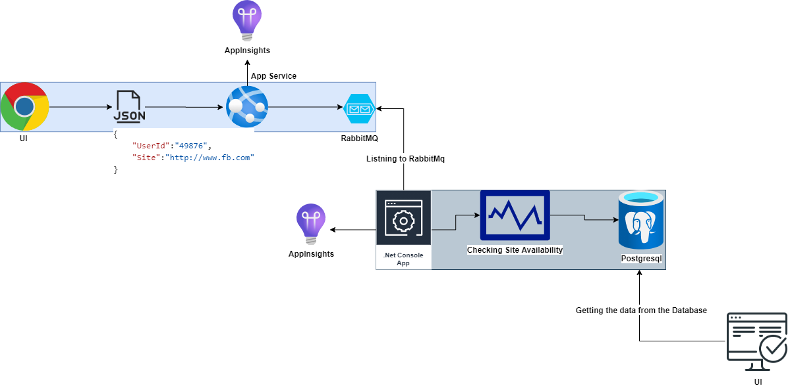
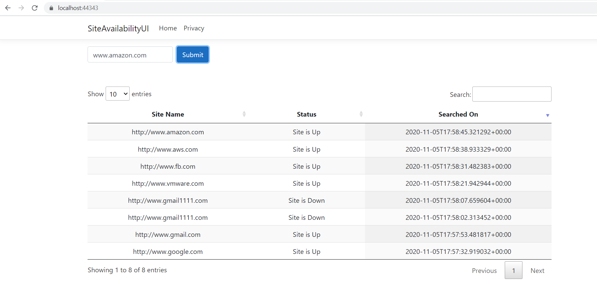
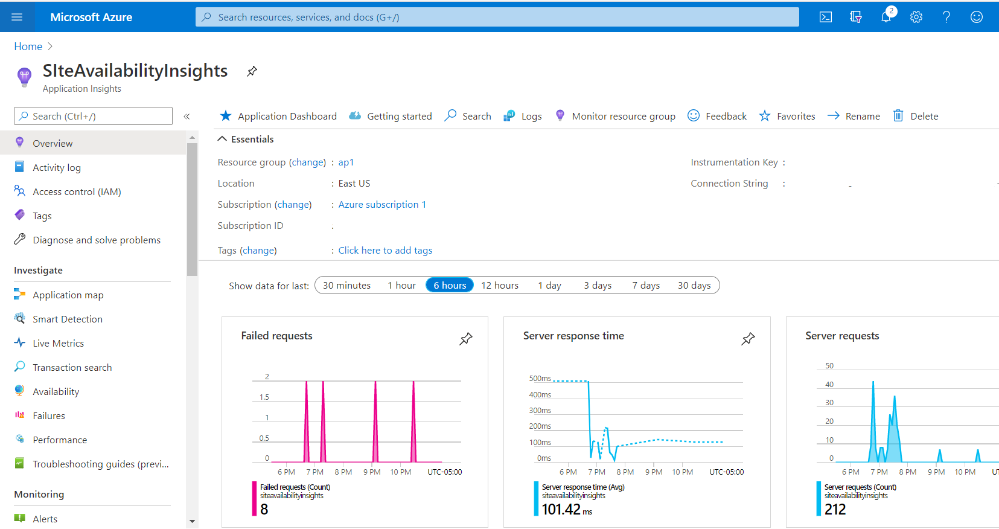

# SiteAvailabilityUI

# Architecture Diagram

# TechStack : 
ASP .Net Core 3.1 MVC,
Bootstrap,
Jquery

# Features : 

1. User can able to search the site availability.
2. User can able to see their last searched results.

# Deployement
This site is deployed in App service in Azure.

# Telemetry

AppInsights

